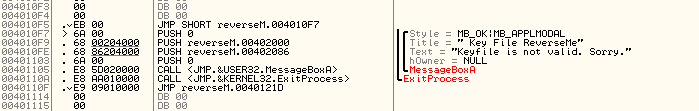
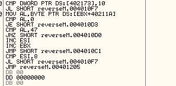

### LENA 01 풀이
## 목표
LENA 01번을 파일 수정 없이 풀어보자. 
## 풀이

그냥 실행하면 처음에는 실패할 것이다. "Evaluation period...." 같은 게 뜰 거다. 
초반에 보면 CreateFileA가 있다. 이건 파일을 열거나 만드는 api이다. 그런데 들어간 인자를 보자. OPEN_EXISTING이라는 인자가 있다. 여기서 알 수 있는 건 존재하는 파일을 여는 옵션이라는 것이다. 그리고 파일이름 인자로 Keyfile.dat이 들어간다. 현재 제공된 파일에는 Keyfile.dat이 없으므로 이걸 추가해줘야 한다는 걸 알 수 있다. .dat 파일 만들 줄 모르는 사람은 Notepad++ 나 visual studio를 애용하도록 하자. 
그러면 오류가 "keyfile not valid"로 바뀔 것이다. 처음 체크는 통과했다는 뜻이다. 

이 코드 때문이다. 
두 번째 체크를 통과해 보자. 다시 첫 번째 사진을 보면 ReadFile을 하게 되는데, 읽을 바이트가 70이다. 즉, 70바이트의 문자가 파일 안에 있어야지 일단 ReadFile이 성공한다는 뜻이다. 아무거나 70바이트를 써 주자. 
그래도 오류가 여전히 동일할 것이다. 이건 다음 부분을 처리하지 못해서 그렇다. 자세히 살펴보자. 
먼저 cmp 10이 있는데 이 부분은 그다지 중요하지 않다. 중요한 건 다음의 mov [ebx+0x40211a] 이 부분이다. 0x40211a에는 우리가 입력한 파일의 내용이 들어 있다. Readfile을 다시 보면 버퍼로 이 주소를 가져가기 때문이다. 그런데 여기에 ebx를 더하고 그 중 한 바이트를 0와 비교한다. 이때, 0라면 바로 키파일이 이상하다는 알림으로 점프하므로 0, 즉 NULL이어서는 안 된다. 그리고 아래로 내려가면 47과 비교하고, 아니라면 esi를 증가시키지 않는다. 그리고 ebx를 증가시키고 반복한다. 그리고 esi가 8이 아니라면 바로 키파일이 이상하다는 알림으로 점프, 아니라면 성공이다. 이 로직을 정리하면 이렇다 - 키파일이 끝날 때까지 파일 내용을 한 글자씩 가져온다. 그리고 그 파일에서 47, 즉 G가 몇 개나 있는지 확인한다. 8개라면 성공한다. 
## 결론
그렇게 어려운 문제는 아니다. 하지만 온갖 반복문이 있는 게 성질이 좀 나는 문제이다. 