이 분석은 오로지 교육적 목적임을 미리 알려드립니다. 모든 저작권은 원작자에게 있고, 문제가 될 시 즉시 삭제하겠습니다. 이 행맨 프로그램의 제작자는 sourceforge의 awmanoj 입니다. 
### 오픈소스 행맨 프로그램 분석
이 프로그램은 strip 되어있지 않고 함수의 이름이 명확해서 분석하기 좋다. 
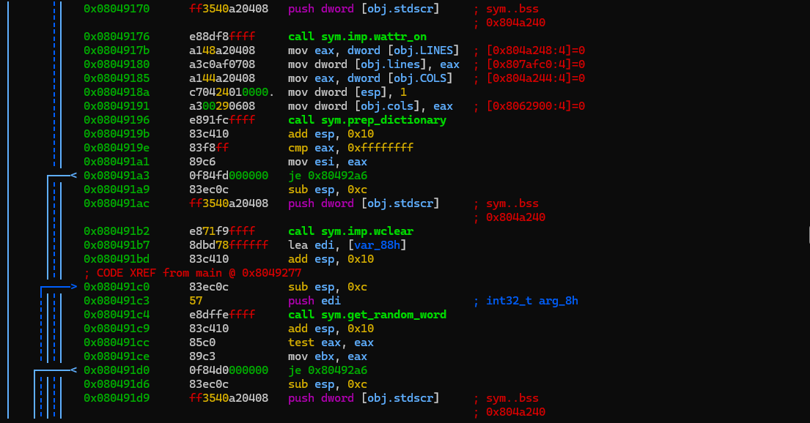
main을 보면, prep_dictionary라는 함수가 있는데 사실 보기만 해도 대충 용도를 알 수 있다. 한 번 검증해 보자. 
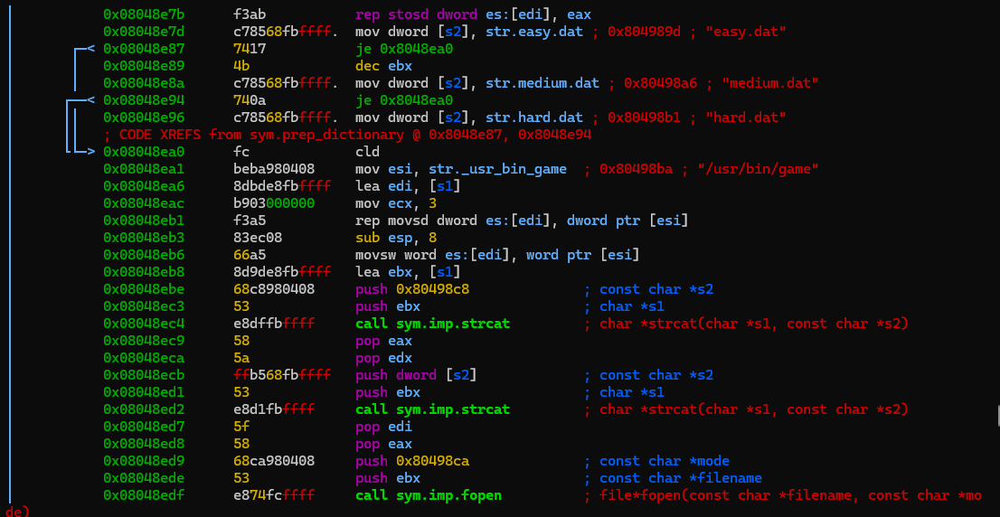
사진을 보면 파일명에 경로를 붙이고, 그 경로의 파일을 열어서 읽어오는 걸 알 수 있다. 다만 표시된 세 개의 파일 중 어떤 파일을 쓰는지는 알 수 없었는데, README를 따로 보니 medium.dat을 쓴다고 적혀 있었다. 아마 내부 값으로 고정하는 듯하다. 
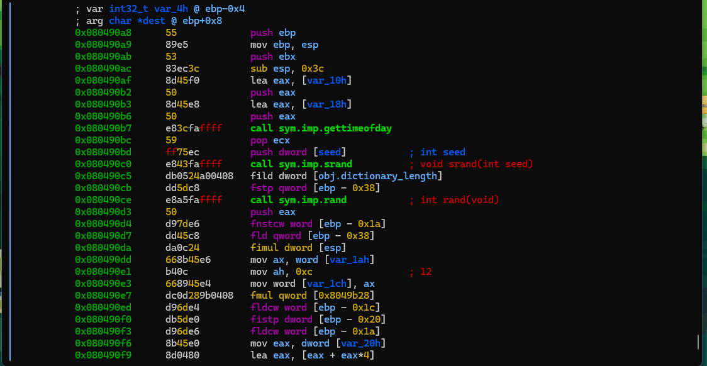
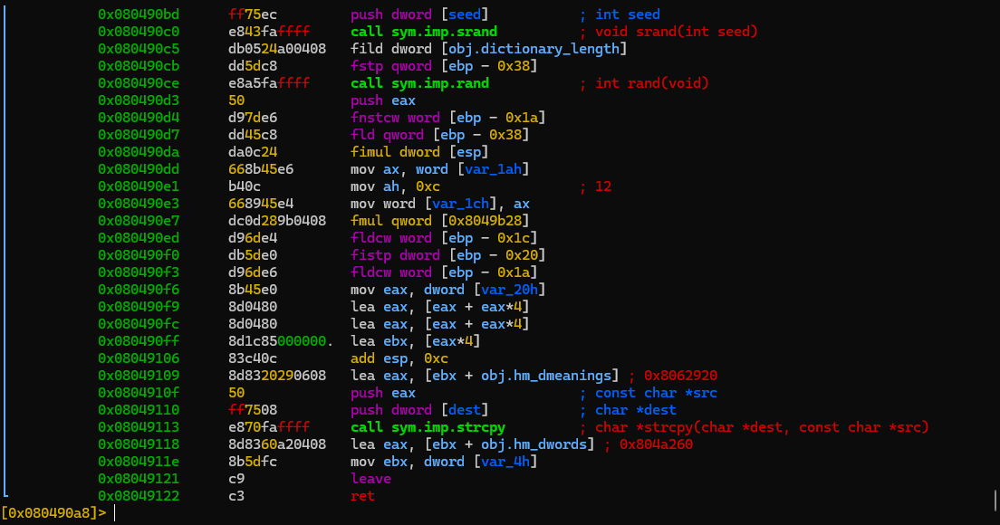
이건 main에서 다음으로 사용하는 get_random_word 함수의 내부이다. 현재의 시간을 가져온 후, srand와 rand를 통해서 랜덤 값을 뽑고, 거기서 인덱스를 가져와 사용한다. 이 부분에 대해서는 자세히 분석하지는 않겠다. 
다음은 게임의 전반적인 것을 담당하는 hangman_main 함수를 분석해 보겠다. 
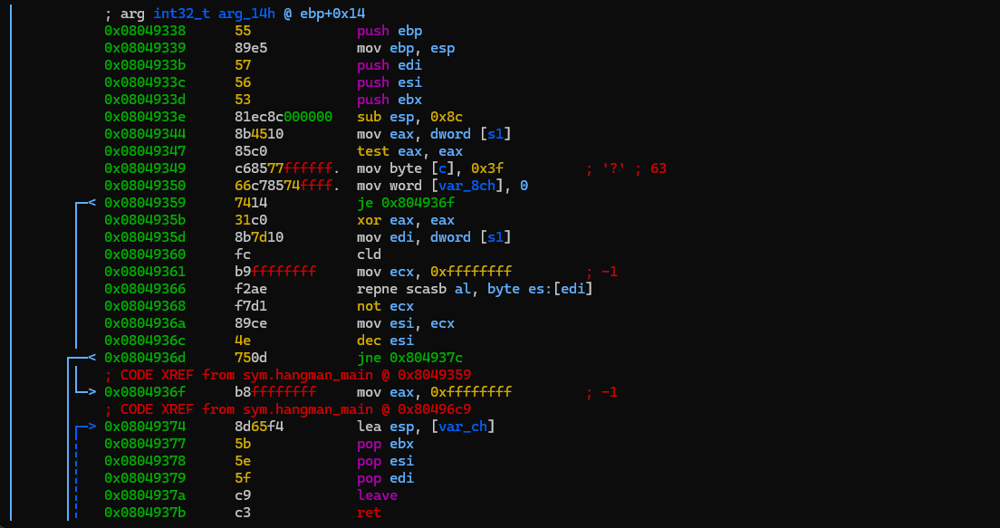
이 블록은 hangman_main 함수의 시작이고, 초기화 블록이다. 눈여겨봐야 할 부분은 [c]라는 변수를 ?로 초기화한다는 것이다. 그 외의 이 부분의 로직은 크게 중요하지 않다. jne 0x804937c를 따라가지 않으면 ret으로 바로 가기 때문에, 저 점프를 따라가 보자. 
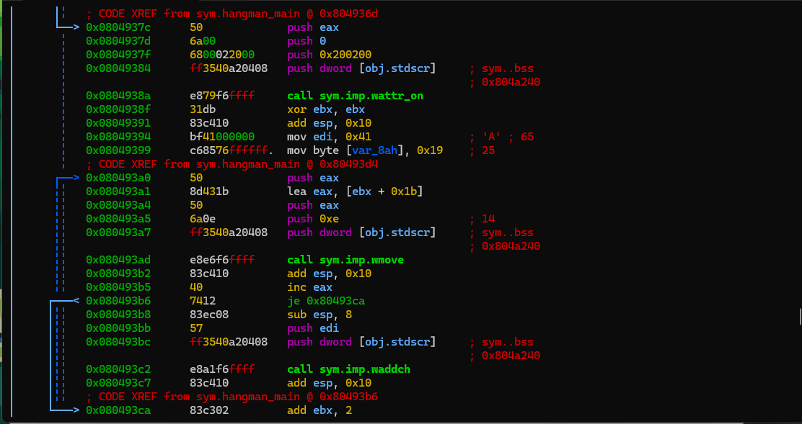
이쪽의 로직은 간단하다. wattr_on으로 화면에 설정을 먹이고, wmove로 커서를 옮기고, waddch로 화면에 글자를 하나씩 꽂는다. edi가 A로 설정된 걸 알 수 있다. 
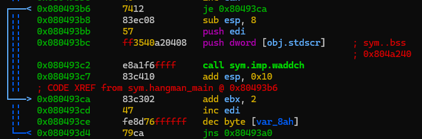
이 사진을 보면 edi를 하나씩 늘려가며 알파벳을 표시한다. 
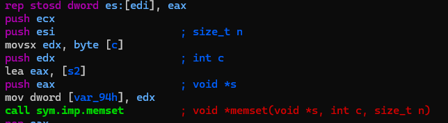
이 구간에서 memset으로 s2를 몽땅 ? 로 채운다. 여기서 s2가 우리가 입력해야 할 버퍼라는 걸 알 수 있다. 
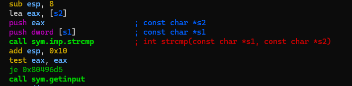
그 아래에서 strcmp가 이루어진다. 사진에서는 보이지 않지만 동일하다면 게임에 승리할 수 있다. 여기서 우리는 s1이 원본 문자열이라는 것, s2에 우리가 입력한 문자가 하나씩 채워질 것이라는 것을 알 수 있다. 
입력을 받고 난 후 그걸 소문자로 변경한다. 그 다음 
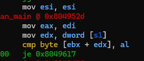
이 부분을 통해 현재 원본 문자열의 한 부분과 내가 입력한 문자가 동일한지 본다. 
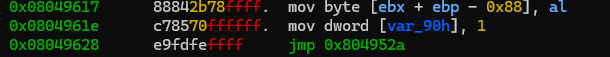
동일하다면 현재 입력한 문자를 s2의 같은 인덱스에 집어넣고, var_90을 0으로 바꾼 후 점프한다. 이 점프는 인덱스인 ebx를 늘리고 다시 아까 이미지 9번의 비교 로직으로 돌아간다. 
그러다 길이가 끝나서 모든 비교와 입력이 끝났으면 출력을 해야 한다. 이 프로그램은 매번 출력을 새로 하지 않는다. 이미 출력한 부분에서 조금만 수정하여 새 출력을 내뱉는다. 따라서 이미 사용한 글자의 색이 변하는 건, 이미 사용한 글자의 색만을 수정하여 출력한 후 strcmp를 하고 다시 입력으로 돌아간다. 

게임의 승리 조건은 strcmp가 0인 것, 즉 문자열이 완전히 동일해지는 것이다. 하지만 패배 조건도 있다. 
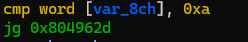
틀린 횟수가 10번을 넘어가면 패배 처리된다. 

### 배운 것
색깔을 반대로 봐서 프로그램이 반대로 동작하는 줄 오해했고, 그것 때문에 프로그램이 화면을 통채로 지우고 다시 쓴다고 생각하고 있었다. 